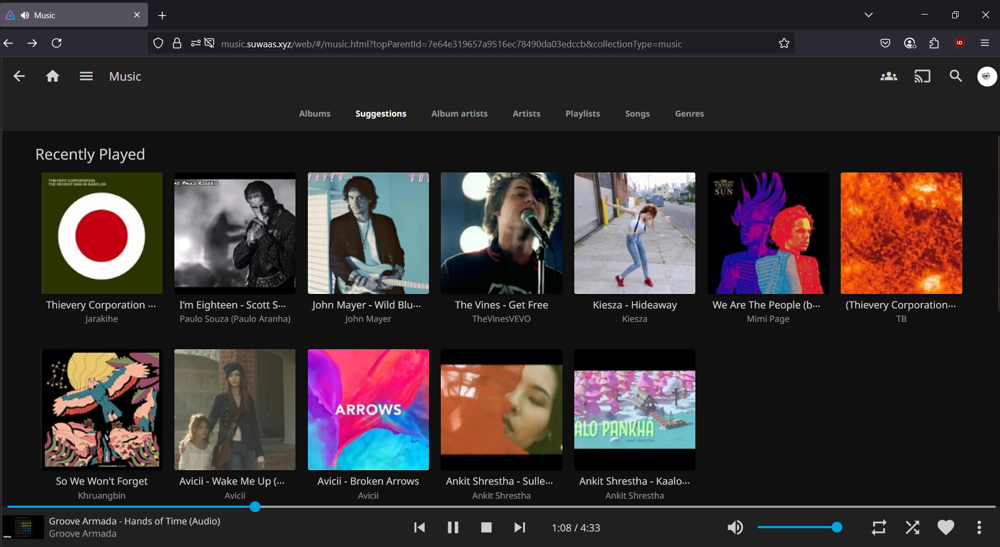

# selfhostedAF
A secure, self-hosted media server using Jellyfin, Docker, and Cloudflare Tunnel because why pay Google when you can suffer yourself?

## What is this?

**I turned an old, dusty PC into a fully-loaded, ad-free, self-hosted media beast.**

**selfhostedAF** is a DIY project that says:
- No to cloud subscription hell
- No to YouTube ads every 3.5 seconds
- No to port forwarding because my ISP is **SHIT**
- Yes to privacy and glory lol.

---

## What it does

- Runs a **Jellyfin media server** so I can stream my **totally-legally-acquired** content
- Lets me access everything with a **custom domain** like `media.suwaas.xyz`
- Shares files across LAN with **Samba(SMB)**
- Tunnels all that sweet traffic securely through **Cloudflare Tunnel** — no ports harmed
- Runs everything in **Docker** because… of course it does

---

## The Blog (aka where the actual instructions ARE)

**Read the full setup guide with proper screenshots here**:  
[https://suwaas.hashnode.dev/transform-your-old-pc-into-a-home-lab-using-ubuntu-server-and-cloudflare-tunnel](https://suwaas.hashnode.dev/transform-your-old-pc-into-a-home-lab-using-ubuntu-server-and-cloudflare-tunnel)

This repo is not a full tutorial because I'm not writing Markdown novels twice. **You're welcome**.

---

## Why you might care

- Want to build a media server? ✅
- Hate ads and subscriptions? ✅
- ISP blocked your ports? ✅
- Love to spend your mornings suffering? ✅✅✅

---

## Stack

| Tool | Purpose |
|------|---------|
| Ubuntu Server | Runs forever unless you kick the power cable or appoint a new *MD OF NEA* |
| Docker | Containers, because raw installs does not exude **AURA** |
| Jellyfin | Netflix but without the fees, spying, or content you didn’t ask for |
| Cloudflare Tunnel | Your SHIT ISP can’t ruin this for you |
| Samba (SMB) | So Windows can pretend it understands Linux just like me. |
| Hashnode | Where I wrote a 2,000-word rant about this setup |

---

##  Screenshots

Here are some pics of the project being awesome:

| Jellyfin UI | Samba Drive |
|-------------|-------------|
|  |  |
---

## Deployment (for People Who Don't Read Blogs)

If you’re too cool to click blog links and too smart to follow tutorials (-_-), here’s the 10-second rundown:

```bash
# 1. Get Ubuntu server
# 2. Set static IP via Netplan
# 3. Install Samba, Jellyfin
# 4. Create a Cloudflare Tunnel using Docker
# 5. Point your domain at your LAN IP
# 6. Brag on LinkedIn
```
## But again, just read the damn blog — it has pictures.

---

# ⚖️ License
MIT License because this is a personal project, not a SaaS startup.
Do whatever you want — just don’t use this to stream pirated content, obviously(Arrgh)🙃

---

<p align="center">
  
</p>

